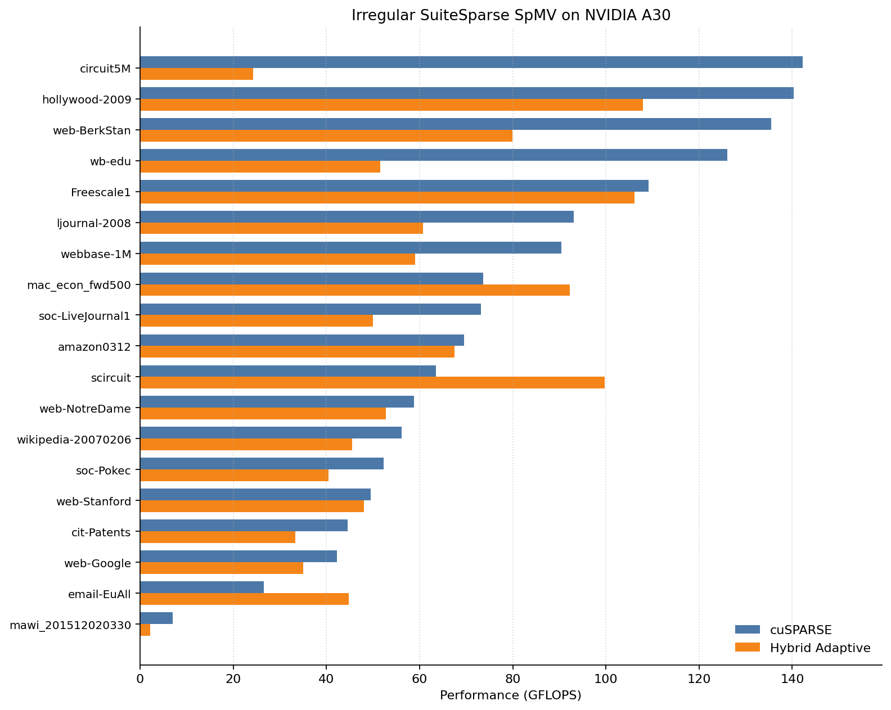
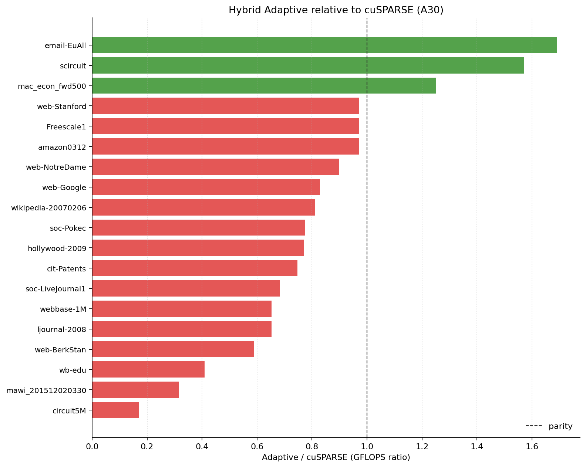

# cuda-SpMV

CSR SpMV for CPU and NVIDIA GPU (A30 / `sm_80`).

## Build
```bash
make            # release
make clean
make debug
```
For other GPUs, change `--gpu-architecture=sm_80` in the `Makefile`.

cuSPARSE baseline: `cd test && ./compile.sh cusparse.cu`.

## Implementations
| Binary | Notes |
|--------|--------|
| `bin/spmv_cpu_csr` | CPU CSR |
| `bin/spmv_cpu_csr_ilp` | CPU + ILP unrolling |
| `bin/spmv_gpu_hybrid_adaptive_csr.exec` | Short / long row split |
| `test/cusparse.exec` | Vendor baseline |

GPU runs print `Verification (...): PASS/FAIL` vs a CPU reference.

```bash
./bin/spmv_gpu_hybrid_adaptive_csr.exec <file.mtx>
```

## Data & benchmarks
Default suite: irregular / scale-free SuiteSparse graphs (≤ 5 GiB each). Pattern matrices are filled with `1.0`.

```bash
./scripts/download_matrices.sh

for impl in adaptive cusparse; do
  for b in 1 2 3; do
    sbatch --job-name=irreg_${impl}_b${b} \
           --output=irregular_${impl}_b${b}-%j.out \
           scripts/run_irregular_suite.sh $impl $b
  done
done

./scripts/extract_spmv_data.sh
```

## Results (A30)

Data: [`results/irregular_adaptive_vs_cusparse.csv`](results/irregular_adaptive_vs_cusparse.csv).

Generate the figures locally (needs `matplotlib`):
```bash
python3 scripts/plot_irregular_results.py
```





## Hardware
AMD EPYC 9334 · NVIDIA A30 24 GB · CUDA 12.5
